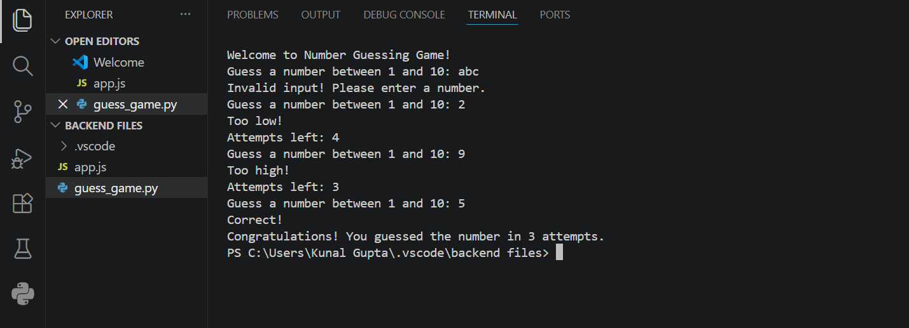

# Number Guessing Game

A simple Python game where the user has to guess a number between 1 and 10 within limited attempts.

##  Features
-  Random number generation
-  User input handling
- Error handling for invalid input
-  Limited attempts (5 chances)
-  Simple game logic

## How to Run

1. Open terminal
2. Run the file:
   python guess_game.py

##  Game Preview

## 💡 What I Learned
- Python loops (`while`)
- Conditional statements (`if-else`)
- Input validation
- Basic game logic building
## Author
Dea Gupta  
Aspiring Developer | Learning Python & Web Development 
